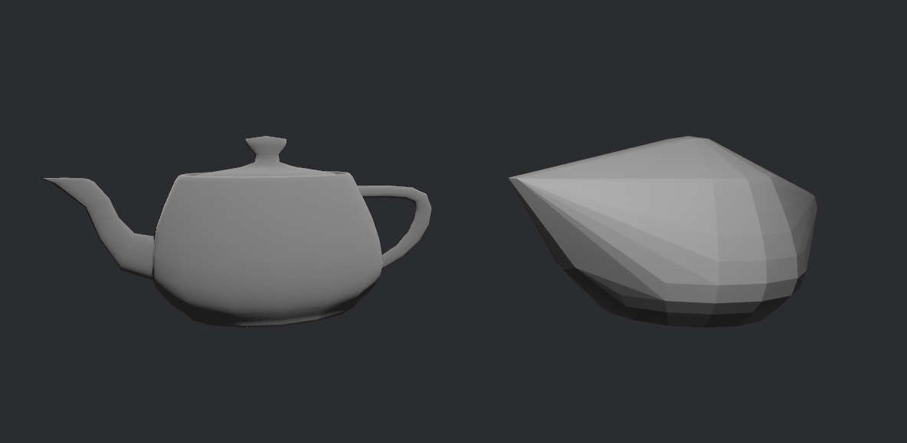

# Quickhull

A Rust implementation of the Quickhull algorithm for computing [convex hulls] for 2D and 3D point sets.



*The Utah teapot and its convex hull*

[convex hulls]: https://en.wikipedia.org/wiki/Convex_hull

## Implementation

The 2D implementation is based on [`geo`], and uses the [`robust`](https://github.com/georust/robust)
crate for robust geometric predicates. It should handle arbitrary point clouds without failure.

The 3D implementation is largely adapted from [`parry3d`]. It is designed to be very fast,
while handling degenerate cases such as coplanar inputs reliably. Note that in some rare edge cases,
it can still fail and return an error.

Only `f32` vector types from [`glam`](https://docs.rs/glam/latest/glam/) are currently supported.

## 3D Example

```rust
use glam::Vec3A;
use quickhull::ConvexHull3d;

// Define a set of 3D points.
let points = vec![
    Vec3A::new(0.0, 0.0, 0.0),
    Vec3A::new(1.0, 0.0, 0.0),
    Vec3A::new(0.0, 1.0, 0.0),
    Vec3A::new(0.0, 0.0, 1.0),
];

// No limit on the number of iterations.
let max_iter = None;

// Compute the convex hull.
let hull = ConvexHull3d::try_from_points(&points, max_iter).unwrap();

// Get the vertices and indices of the convex hull.
let (vertices, indices) = hull.vertices_indices();

// The hull should be a tetrahedron with 4 vertices and 4 triangular faces.
assert_eq!(vertices.len(), 4);
assert_eq!(indices.len(), 4);
```

## References

- The [`geo`] crate
- The [`parry3d`] crate
- C. Bradford Barber et al. 1996. [The Quickhull Algorithm for Convex Hulls](https://www.cise.ufl.edu/~ungor/courses/fall06/papers/QuickHull.pdf) (the original paper)
- Dirk Gregorius. GDC 2014. [Physics for Game Programmers: Implementing Quickhull](https://archive.org/details/GDC2014Gregorius)

[`geo`]: https://github.com/georust/geo/blob/8940db79aa6aa4ec8820d6328c68a2ae08ac8fdc/geo/src/algorithm/convex_hull/qhull.rs
[`parry3d`]: https://github.com/dimforge/parry/blob/9db68641adf69e1f307ac9199d34d82b6d049219/src/transformation/convex_hull3/convex_hull.rs

## License

This Quickhull crate is free and open source. All code in this repository is dual-licensed under either:

- MIT License ([LICENSE-MIT](/LICENSE-MIT) or <http://opensource.org/licenses/MIT>)
- Apache License, Version 2.0 ([LICENSE-APACHE](/LICENSE-APACHE) or <http://www.apache.org/licenses/LICENSE-2.0>)

at your option.
